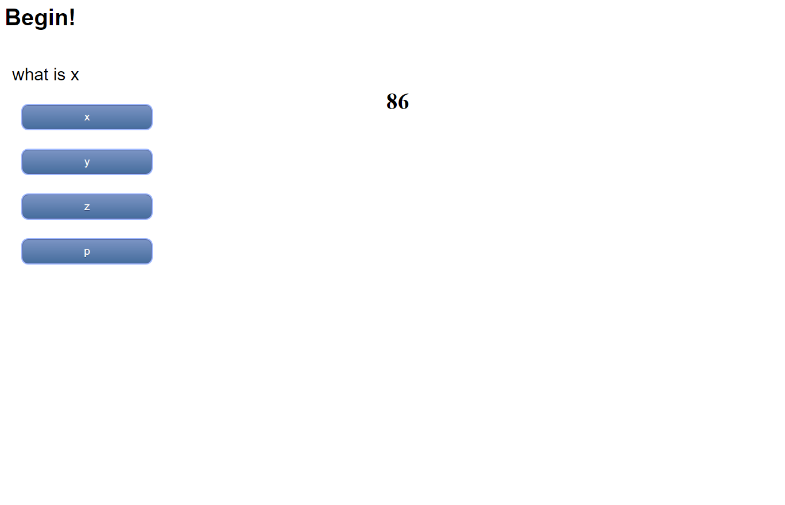

# Javascript Fundamentals Quiz

## Purpose
A website that holds a quiz for javascript fundamentals. Starts with a timer and
 work through a series of questions, presenting correct or incorrect answers. 
 Finishes with scoreboard using local storage.

## Built with
* HTML
* CSS
* JavaScript

## Website
https://zaclark369.github.io/JavaScript-quiz-fundamentals/

## Screenshot
The websites landing page.
   

## Contribution
Made by Zachary Clark
* https://github.com/zaclark369

### ©️2021 
